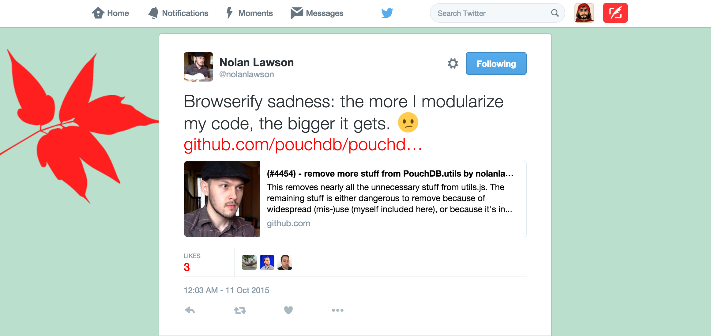
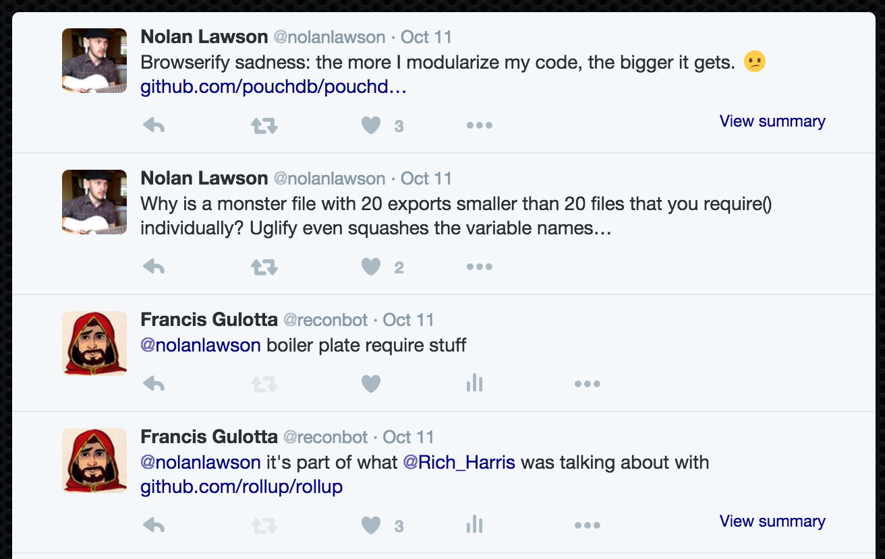
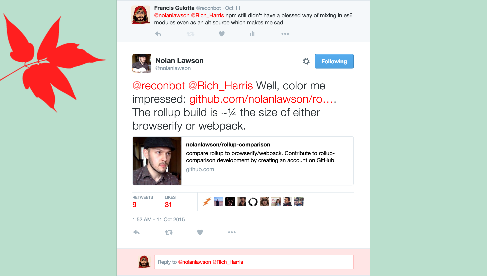
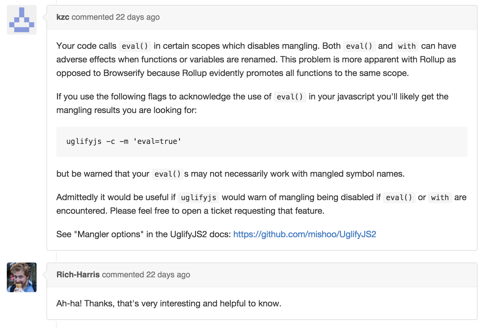
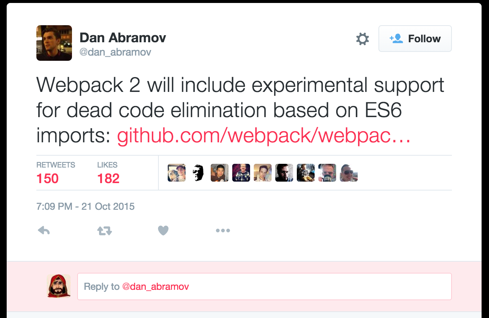
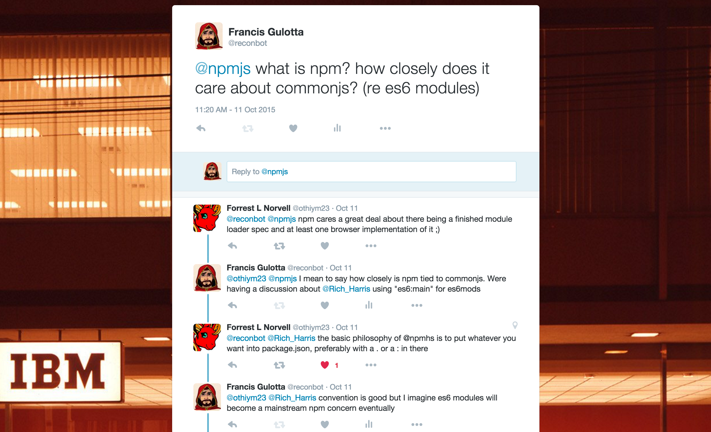
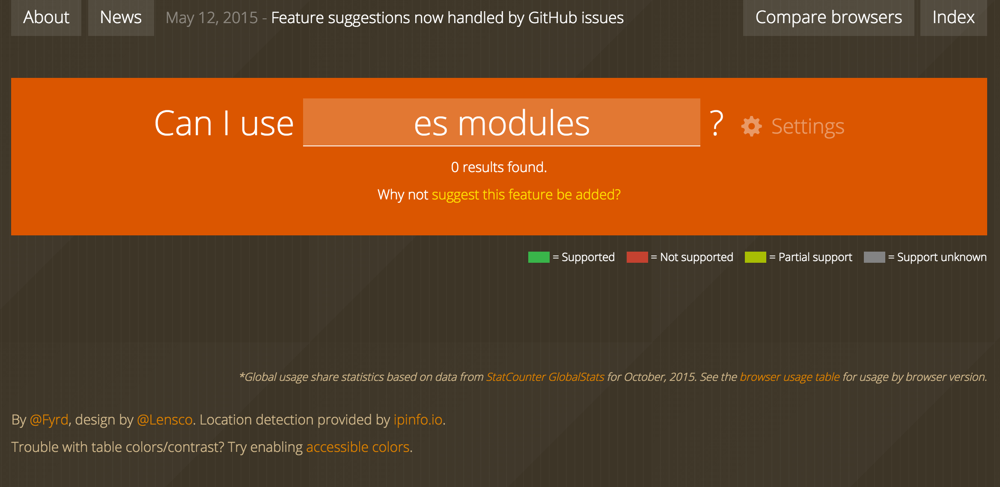
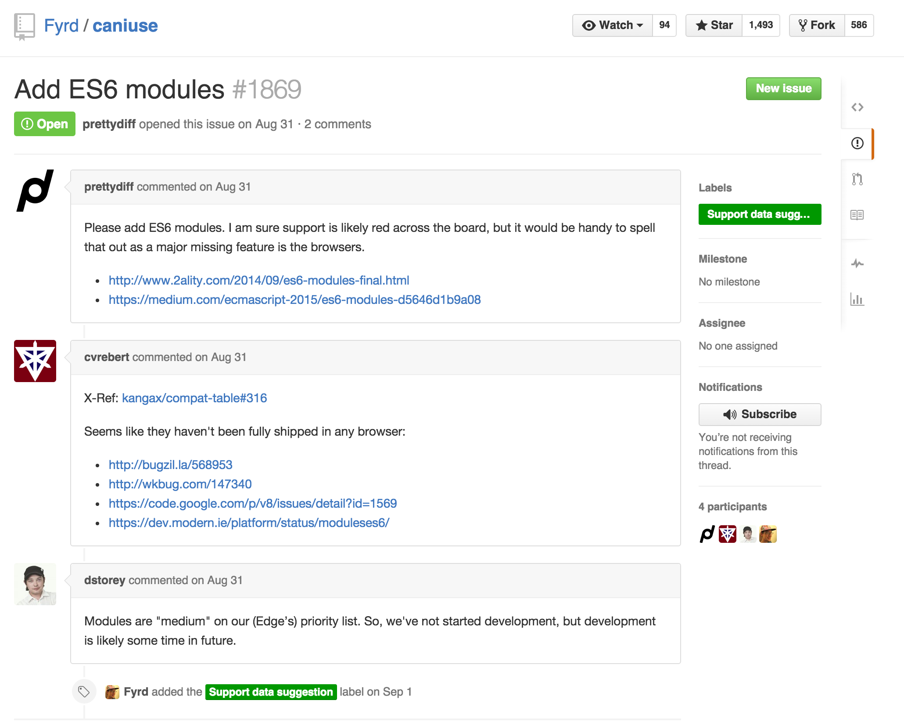

# [fit] Modules, Packages
# [fit] and *candy* **oh my!**

---

Hi I'm Francis

---

#reconbot


---

 - Set the stage
 - Explore the landscape
 - What can you do to get free candy?

---

# [fit] The stage

---

# Job Interview

---

I had a *job interview* and I've spent the last two years not really paying attention to *new* things.

---

*WebPack* is Cool!
Is *Browserify* still cool?

---

*ES Modules* are Cool!
Is *Common JS* still cool?

---

*ES6* itself is **really** cool

---

*ES2015* ~~ES6~~ itself is **really** cool

---

Babel

---

# Babel

---

# [fit] Babel

---

# Babel

ES6 and ES7 proposals and specs
*into*
ES5

---

# Babel

~~ES6 and ES7~~ *ECMA 2015-Next* proposals and specs
*into*
*ES5* (ES4 with polyfills)

---

# Browser packaging

`commonJS with es6 -> browserify -> babelify -> single file bundle of es5`

---

# node packaging

`commonJS with es6 -> browserify(--node) -> babelify -> single file bundle of es5`

---

# node packaging

`commonJS with es6 -> babel -> many es5 files`

---

This works for me for a while but I have a *job interview*.

---

What are es6 modules?
Why should we use them?

---

Exporting One thing

```js
// CommonJS
module.exports = 'a thing';
// ES Modules
export default 'a thing';


//
```

---

node-love is a good example

```js
// CommonJS
var heart = require("node-love");
// '♥'

// ES Modules
import heart from "node-love";
// '♥'


//
```

---

Exporting Many Things

```js
// CommonJS
module.exports = {
  oneThing: 'a thing',
  anotherThing: () => { console.log('a thing') },
  lastThing: 4
};

require('foo').oneThing; // 'a thing'


//
```
---

Don't do this

```js
// ES Modules (equivalent to CommonJS export)
export default {
  oneThing: 'a thing',
  anotherThing: () => { console.log('a thing') },
  lastThing: 4
};

import foo from 'foo';
foo.oneThing // 'a thing'

//
```
---

Exporting Many Things

```js
// ES Modules
export var oneThing = 'a thing';
export function anotherThing(){ console.log('a thing') };

var lastThing = 4;
export { lastThing };

import { oneThing } from 'foo'; // 'a thing'


//
```
---

Exporting Many Things

```js
// ES Modules
export var oneThing = 'a thing';
export function anotherThing(){ console.log('a thing') };

var bar = 4;
export { bar as lastThing };

import { oneThing } from 'foo'; // 'a thing'


//
```
---

ES Modules Can Do Both!?

```js
// foo.js
export default 'bar';
export var lastThing = '4';

// bar.js
import { lastThing } from 'foo'; // 4
import foo from 'foo'; // 'bar'
import foo, { lastThing } from 'foo'; // bar and 4!


//
```

---

ES Modules Can Do Both

```js
// underscore.js
export function flatten(array) { /* flatten the array */ };
export function zip(array) { /* zip the array? */ };
export default {
  flatten: flatten,
  zip: zip
};

// bar.js
import { flatten } from 'underscore';
import _ from 'underscore';


//
```
---

ES Modules Can Do Both

```js
// underscore.js
export function flatten(array) { /* flatten the array */ };
export function zip(array) { /* zip the array? */ };
export default {
  flatten,
  zip
};

// bar.js
import { flatten } from 'underscore';
import _ from 'underscore';


//
```

---

# [fit] Modules are cool and all but who cares?

---

## We do

---

> Note CommonJS and ECMAScript 6 are only roughly similar. The latter has a flat structure, whereas the former is nested. Which style you prefer is a matter of taste, but the flat style has the advantage of being statically analyzable.

-- Dr. Axel Rauschmayer

---

## Statically Analyzable

---
```
                           CommonJS Module Import Mapping

                     +-----------------+
                     |     MODULE      |        +------------------+
                     |       A         |        |     MODULE       |
                     +----------+------+        |       C          |
                                |               +-------+----------+
                                |                       |
                             +--v----------------+      |
                             |      MODULE       <------+
                             |        B          |
                             +-----+-------------+
                                   |
                   +---------------v---+
                   |    YOUR APP.JS    |
                   |                   |
                   +-------------------+


.
```
---

```
                              File Based Import Mapping
+-----------------+
|      MODULE     |            +-----------------+
|     A/foo.js    |            |      MODULE     |
+--------+--------+            |     C/foo.js    |     +------------------+
         |                     +--------+--------+     |   MODULE         |
     +---v-------------+                |              |   A/xyz.js       |
     |     MODULE      |        +-------v----------+   +----+-------------+
     |     A/bar.js    |        |     MODULE       |        |
     +----------+------+        |     C/bar.js     |        |
                |               +-------+----------+        |
             +--v-------------+         |                   |
             |   MODULE       |         |        +----------v---------+
             |   B/baz.js     <---------+        |      MODULE        |
             +-----+----------+                  |      B/foo.js      |
                   |                             +--------------------+
   +---------------v---+
   |    YOUR APP.JS    |
   |                   |
   +-------------------+

```

---

```
                              File Based Import Mapping
+-----------------+
|      MODULE     |            +-----------------+
|     A/foo.js    |            |      MODULE     |
+--------+--------+            |     C/foo.js    |
         |                     +--------+--------+
     +---v-------------+                |
     |     MODULE      |        +-------v----------+
     |     A/bar.js    |        |     MODULE       |
     +----------+------+        |     C/bar.js     |
                |               +-------+----------+
             +--v-------------+         |
             |   MODULE       |         |
             |   B/baz.js     <---------+
             +-----+----------+
                   |
   +---------------v---+
   |    YOUR APP.JS    |
   |                   |
   +-------------------+

```

---

```
                              Named Export Based Import Mapping

                  +--------------------+
                  |        MODULE      |         +-----------------+
                  |  A/foo.js/update() |         |      MODULE     |
                  +--------+-----------+         |C/foo.js/format()|
                           |                     +--------+--------+
                       +---v-------------+                |
                       |     MODULE      |        +-------v----------+
                       | A/bar.js/sync() |        |     MODULE       |
                       +----------+------+        | C/bar.js/toStr() |
                                  |               +-------+----------+
                               +--v----------------+      |
                               |        MODULE     |      |
                               |  B/baz.js/work()  <------+
                               +-----+-------------+
                                     |
                                     |
                     +---------------v---+
                     |    YOUR APP.JS    |
                     |                   |
                     +-------------------+
```

---

## Enter *Rollup*

---

#[fit] *Rollup* the **TreeShaker**

---

#[fit] *Rollup* the **TreeShaker**

```
ES Modules + ES Module deps -> rollup/babel
     -> "Shaken" CommonJS bundle

"Shaken" CommonJS bundle + CommonJS deps -> browserify
     -> ES5 Bundle
```

---

# The Landscape
# :palm_tree:

---

#  PouchDB

---

#  PouchDB
The Database that Syncs!

---



https://twitter.com/nolanlawson/status/653058308643921920

---



---


---


# [fit]https://github.com/Rich-Harris/brooklyn-js-rollup-talk

---


- Green is live code
- Orange is boiler plate
- Purple is dead code

---

# [fit]https://github.com/nolanlawson/rollup-comparison

Shows lack of overhead when requiring modules

---



---

#[fit] 1,000,000 tweets later we had a PR

https://github.com/pouchdb/pouchdb/pull/4462

---

#  PouchDB

`pouchdb-browserify.js  380KB`
`pouchdb-rollup.js      364KB`

%5 savings!

---

#  PouchDB

`pouchdb-browserify.min.js  148KB`
`pouchdb-rollup.min.js      160KB`

%8 loss!?

---
#[fit]Rollup inlines all functions
#[fit] pouchdb has `eval()` in a few places
#[fit]Uglify protects you from breaking things with `eval()`

---
https://github.com/mishoo/UglifyJS2/issues/830#issuecomment-147870241




---
# Moved eval to external modules

`pouchdb-browserify.min.js  148KB`
`pouchdb-rollup.min.js      160KB`
`pouchdb-ext-rollup.min.js  144KB`

`4KB` or 3% savings

---


---

How much space was in dead code?

---

How much space was in dead code in CommonJS deps?

---

How much space was in browserify overhead?

---

How much space was lost to `{objects}` in default exports?

---


---

Goal is smaller bundle for libraries

---

Goal is smaller total bundle for apps

---

```js
var PouchDB = require('./setup');
module.exports = PouchDB;

PouchDB.ajax = require('./deps/ajax/prequest');
PouchDB.utils = require('./utils');
PouchDB.Errors = require('./deps/errors');
PouchDB.replicate = require('./replicate').replicate;
PouchDB.sync = require('./sync');
PouchDB.version = require('./version');
var httpAdapter = require('./adapters/http');
PouchDB.adapter('http', httpAdapter);
PouchDB.adapter('https', httpAdapter);

PouchDB.plugin(require('./mapreduce'));

var adapters = require('./adapters');

Object.keys(adapters).forEach(function (adapterName) {
  PouchDB.adapter(adapterName, adapters[adapterName], true);
});
```

---

#  PouchDB Features (incomplete)

Multiple Storage engines (LevelDB, IndexedDB, WebSQL)
Database Replication with full support for 7 different servers!
Support for Views with CouchDB style map/reduce

---

```js
import PouchDB from './setup';
export default PouchDB;

export ajax from './deps/ajax/prequest';
export utils from './utils';
export Errors from './deps/errors';
export sync from './sync';
export version from './version';
export { replicate } from './replicate';

import httpAdapter from './adapters/http'
export var http = PouchDB.adapter('http', httpAdapter);
export var https = PouchDB.adapter('http', httpAdapter);

import mapreduce from './mapreduce'
PouchDB.plugin(mapreduce);

import adapters from './adapters';

Object.keys(adapters).forEach(function (adapterName) {
  PouchDB.adapter(adapterName, adapters[adapterName], true);
});

```

---

```js
// sweet-app.js
var PouchDb = require('pouchdb');
var db = new PouchDB('dbname');
db.put({
  _id: 'dave@gmail.com',
  name: 'David',
  age: 68
});
db.allDocs().then(console.log);

```

---

```js
// sweeter-app.js
import PouchDb from 'pouchdb';
var db = new PouchDB('dbname');
db.put({
  _id: 'dave@gmail.com',
  name: 'David',
  age: 68
});
db.allDocs().then(console.log);

```

---

# Tools keep evolving

Babel 6!
Rollup now has a babel plugin!
`esnext:main` is gaining traction

---



---


https://twitter.com/dan_abramov/status/656970508005736448

---



---


https://twitter.com/reconbot/status/653228811455209472

---



---



---


---


https://twitter.com/Rich_Harris/status/653186863755304960

---


---

# [fit] Free *candy*

---

How much `pouchdb` do I really use? How big are the bundles?

---
Fun reading that helps understand things

```
"ECMAScript 6 modules: the final syntax" by Dr. Axel Rauschmayer
  http://www.2ality.com/2014/09/es6-modules-final.html

My lovely graphs were made with
  http://asciiflow.com/

Nolan's blog post on packaging libraries
  http://nolanlawson.com/2015/10/19/the-struggles-of-publishing-a-javascript-library/

```

---
My name is Francis @reconbot


I write about the INTERNET I wish we had at


Ask me about great office space
